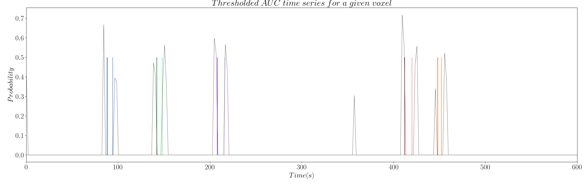

# [Scope of this work](#scope)

The main goal of this work is to estimate neuronal-related activity without any prior information about the timings of the BOLD events. To do this, several algorithms have been proposed in the literature and they all solve the problem by means of regularized least-squares estimators with L1- and L2-norms[^1][^2][^3][^4][^5]. However, there are no algorithms that select an optimal regularization parameter; which is key for accurate estimation. Thus, this work introduces two improvements over the previous Sparse Paradigm Free Mapping (SPFM)[^6] algorithm:

- The addition of a subsampling approach called Stability Selection that avoids the selection of the regularization parameter;
- A modified formulation that allows us to estimate _innovation signals_ in addition to the _activity-inducing signals_.

# [Formulation](#formulation)

In the original SPFM formulation, for a given voxel, the fMRI signal $$y(t)$$ is explained as the convolution of the haemodynamic responde function (HRF) $$h(t)$$ and the activity-inducing signal $$s(t)$$. Gaussian noise $$n(t)$$ is also considered. As we know the activity-inducing signal is sparse, we estimate it by means of regularized least-squares with an L1 penalty.

$$
\mathbf{y} = \mathbf{H}\mathbf{s} + \mathbf{n}
$$

$$
\hat{\mathbf{s}}=\underset{\mathbf{s}}{\operatorname{argmin}} \frac{1}{2}\|\mathbf{y}-\mathbf{H s}\|_{2}^{2}+\lambda|\mathbf{s}|_{1} \tag{1}
$$

{:width="100%"}
**Figure 1: Simulated signal with activity-inducing signal $$\mathbf{s}$$ of the 5 different simulated neuronal-related events.**

Yet, this work introduces a modification to this formulation: the estimation of the innovation signal $$u(t)$$, which is the derivative of the activity-inducing signal; i.e. $$\mathbf{u} = \mathbf{D}\mathbf{s}$$. In order to estimate the innovation signal, we add an integration operator $$\mathbf{L}$$ into our design matrix $$\mathbf{H}$$, and we solve the same regularized least-squares problem[^7].

$$
\mathbf{y} = \mathbf{H}\mathbf{L}\mathbf{s} + \mathbf{n} 
$$

$$
\widehat{\mathbf{u}}=\underset{\mathbf{u}}{\operatorname{argmin}} \frac{1}{2}\|\mathbf{y}-\mathbf{H} \mathbf{L u}\|_{2}^{2}+\lambda|\mathbf{u}|_{1} \tag{2}
$$

where

$$
\mathbf{D}=\left[\begin{array}{ccccc}
1 & 0 & \cdots & & \\
1 & -1 & 0 & \cdots & \\
0 & \ddots & \ddots & \ddots & \ldots \\
\vdots & \ddots & 0 & 1 & -1
\end{array}\right], 
$$

$$
\mathbf{L}=\left[\begin{array}{ccccc}
1 & 0 & \cdots & & \\
1 & 1 & 0 & \cdots & \\
1 & 1 & 1 & 0 & \cdots \\
\vdots & \ddots & \ddots & \ddots & \ddots
\end{array}\right] .
$$

{:width="100%"}
**Figure 2: Simulated signal with innovation signal $$\mathbf{u}$$ of the 5 different simulated neuronal-related events.**

# [Regularization path](#regularization-path)

The selection of the regularization parameter $$\lambda$$ is key for an optimal solution when solving optimization problems. This can be clearly seen when computing the regularization paths with the Least Angle Regression algorithm[^8] (see Figure 3 and 4), which can be done with the following lines of code:

```python
import matplotlib.pyplot as plt
from sklearn.linear_model import lars_path as lars

# After importing data and hrf matrices
data_voxel = data[:, 0]
nscans = data_voxel.shape[0]
nlambdas = nscans + 1

# Compute regularization path
_, _, coef_path = lars(hrf, np.squeeze(data_voxel), method='lasso',
                       Gram=np.dot(hrf.T, hrf), Xy=np.dot(hrf.T, np.squeeze(data_voxel)),
                       max_iter=nlambdas-1, eps=1e-9)

# Plot regularization path
plt.plot(coef_path.T)
plt.show()
```

{:width="100%"}
**Figure 3: Regularization path for activity-inducing signals.**

{:width="100%"}
**Figure 4: Regularization path for innovation signals.**

In the case of the activity-inducing signals, most of the events from the previous example appear at a high value of $$\lambda$$, while a few of them are buried in the lower values of $$\lambda$$. In the case of the innovation signals, it is not clear what the optimal $$\lambda$$ is. So, what is the value of $$\lambda$$ that yields the optimal solution? That's where [Stability Selection](https://eurunuela.github.io/OHBM_2020#stability-selection)[^9] comes in.

# [Stability Selection](#stability-selection)

Following the stability selection procedure[^9], we generate 100 subsampled surrogate datasets that randomly keep 60% of the timepoints of the original data $$\mathbf{y}$$ and the design matrix $$\mathbf{H}$$. Then, we solve the optimization problem in (1) and compute the regularization path for each of the surrogates datasets using LARS. Once we have compute the regularization path of each surrogate dataset, we project the paths into a space with shared values of $$\lambda$$. This step is necessary given the different values of $$\lambda$$ that LARS[^8] finds for each surrogate. Finally, we calculate the probability of each coefficient (i.e. time point) being non-zero for each value of $$\lambda$$. This last step lets us build the _probability paths_ shown in Figure 5 and 6. The code to compute the stability selection with LARS can be found [here](https://github.com/eurunuela/OHBM_2020/blob/master/scripts/stability_selection.py#L19-76).

{:width="100%"}
**Figure 5: Stability path for activity-inducing signals.**

{:width="100%"}
**Figure 6: Stability path for innovation signals.**

However, we still have to find/select the true coefficients from the stability paths. Unlike the original approach[^9], which suggests to keep all coefficients above a given threshold, we suggest to calculate the area under the curve (AUC) of the paths of each time point $$t$$ as follows:

$$
AUC_{t}=\frac{\sum_{l=1}^{L} \lambda_{l} P\left(u_{\lambda_{l}, t} \neq 0\right)}{\sum_{l=1}^{L} \lambda_{l}} \tag{3}
$$

The computation of AUC yields a time series for each voxel that is related to the probability of a coefficient (i.e. time point) being non-zero (see Figure 7 and 8). 

{:width="100%"}
**Figure 7: AUC time series for activity-inducing signals.**

{:width="100%"}
**Figure 8: AUC time series for innovation signals.**

However, the AUC is non-zero by definition, which means we have to set a threshold to only keep the estimations of true neuronal-related events. Hence, we propose to threshold the AUC time series with the 99th percentile of the AUC time series of a region of non interest (see Figure 9 and 10); e.g. the deep white matter, as we do not expect top find any BOLD events in this region.

{:width="100%"}
**Figure 9: Thresholded AUC time series for activity-inducing signals.**

{:width="100%"}
**Figure 10: Thresholded AUC time series for innovation signals.**

Once we have thresholded the AUC, we perform a final debiasing step with the selected non-zero coefficients to get our  estimates of the activity-inducing signal and the innovation signal as follows:

$$
\hat{\mathbf{s}}=\underset{\mathbf{s}}{\operatorname{argmin}}\|\mathbf{y}-\mathbf{H s}\|_{2}^{2} \tag{4}
$$

Rather, in the signal model with the innovation signal (2), the selected non-zero coefficients of $$\mathbf{u}$$ are used to define a matrix $$\mathbf{A}$$ whose columns are activation segments with piecewise constant unit between two non-zero coefficients of $$\mathbf{u}$$ [^10].

$$
\hat{\mathbf{s}}=\underset{\mathbf{s}}{\operatorname{argmin}}\|\mathbf{y}-\mathbf{H A s}\|_{2}^{2} \tag{5}
$$

> You can fin the code used to generate all the figures [here](https://github.com/eurunuela/OHBM_2020/tree/master/scripts/plotting.py). The simulated data used can be found [here](https://github.com/eurunuela/OHBM_2020/tree/master/data).

# [Benchmarking](#benchmarking)

We tested the two improvements with a finger tapping paradigm that contained trials of single and multiple taps, as shown in the Figure 11.

{:width="100%"}
**Figure 11: Estimates of the neuronal-related events for a finger tapping paradigm in a high SNR scenario. Each column shows a different moment in time of the finger tapping paradigm, with the three columns on the left belonging to single-tap events while the three columns on the right belong to multi-tap events.**

Two fMRI datasets were acquired with a 7 Tesla scanner:

- High SNR scenario: TR = 500 ms, voxelsize = 3x3x3 mm<sup>3</sup>;
- Low SNR scenario: TR = 2800 ms, voxel size = 1.2x1.2x1.2 mm<sup>3</sup>.

We compared the 4D maps produced with the proposed stability-based SPFM approach with the maps obtained with the original SPFM and a conventional single trial GLM analysis. Video 1 shows a segment of the AUC time series for one of the two datasets.

<video class="embed_video" autoplay loop controls style="width=70%">
    <source src="./images/auc.mov" type="video/mp4">
</video>
**Video 1: egment of the AUC time series for one of the finger tapping datasets.**

In the high SNR scenario, we can see that all three SPFM approaches are able to correctly estimate the different finger tapping eventsM. ore interestingly, the addition of the integration operator that allows us to estimate the innovation signal yields maps that are close to the gold standard of the GLM analysis. However, the amplitude of the estimations of the innovation signals is considerably lower.

{:width="100%"}
**Figure 12: Estimates of the neuronal-related events for a finger tapping paradigm in a high SNR scenario. Each column shows a different moment in time of the finger tapping paradigm, with the three columns on the left belonging to single-tap events while the three columns on the right belong to multi-tap events.**

Yet, it is in the low SNR scenario where we can see that the stability selection approach offers more robust estimates. The original SPFM struggles with the single tap events, while the stability-based SPFM approaches yield maps that are similar to the GLM analysis, specially when we add the integration operator to the formulation.

{:width="100%"}
**Figure 13: Estimates of the neuronal-related events for a finger-tapping paradigm in a low SNR scenario.
Each column shows a different moment in time of the finger tapping paradigm, with the three columns on the left belonging to single-tap events while the three columns on the right belong to multi-tap events.**

# [Take-home messages](#take-home)

- The combination of SPFM with stability selection offers more robust estimates of neuronal-related activity, specially at low SNR.
- The addition of an integration operator allows to estimate innovation signals, yielding activity maps that are closer to the gold standard obtained with GLM trial-level analysis. Yet, the amplitude of the events might be underestimated, whereas their duration is overestimated.
- Improvements due to the integration operator highly depend on the paradigm; e.g. tasks with block events would benefit more than short event-related trials.

---

[^1]: D. R. Gitelman, W. D. Penny, J. Ashburner, and K. J. Friston, “Modeling regional and psychophysiologic interactions in fMRI: The importance of hemodynamic deconvolution”, Neuroimage, vol. 19, pp. 200–207, 2003.

[^2]: I. Khalidov, J. Fadili, F. Lazeyras, D. Van De Ville, and M. Unser, “Activelets: Wavelets for Sparse Representation of Hemodynamic Responses”, Signal Processing, vol. 91, pp. 2810–2821, 2011.

[^3]: F.I. Karahanoǧlu, C. Caballero-Gaudes, F. Lazeyras, and D. Van De Ville, “Total Activation: FMRI Deconvolution through Spatio-Temporal Regularization”, Neuroimage, vol. 73, pp. 121-134, 2013.

[^4]: L. Hernandez-Garcia and M.O. Ulfarsson, “Neuronal event detection in fMRI time series using iterative deconvolution techniques”, Magnetic Resonance Imaging, vol. 2, pp. 353-364, 2011.

[^5]: C. C. Gaudes, N. Petridou, I.L. Dryden, L. Bai, S.T. Francis, and P.A. Gowland, “Detection and Characterization of Single-Trial FMRI Bold Responses: Paradigm Free Mapping”, Human Brain Mapping, vol. 32, pp. 1400-1418, 2011.

[^6]: C. Caballero-Gaudes, N. Petridou, S.T. Francis, I.L. Dryden, and P.A. Gowland, “Paradigm Free Mapping with Sparse Regression Automatically Detects Single-Trial Functional Magnetic Resonance Imaging Blood Oxygenation Level Dependent Responses”, Human Brain Mapping, vol. 34, pp. 501-518, 2013.

[^7]: H. Cherkaoui, T. Moreau, A. Halimi, and P. Ciuciu, “Sparsity-Based Blind Deconvolution of Neural Activation Signal in FMRI”, Proceedings of the IEEE International Conference on Acoustics, Speech and Signal Processing (ICASSP), pp. 1323–1327, 2019.

[^8]: B. Efron, T. Hastie, I. Johnstone, and R. Tibshirani, “Least Angle Regression”, The Annals of Statistics, vol. 32, pp. 407–499, 2004.

[^9]: N. Meinshausen and P. Bühlmann, “Stability Selection”, J. R. Statist. Soc. B, vol. 72, pp. 417–73, 2010.

[^10]: D.M. Zöller, T.A.W. Bolton, F.I. Karahanoglu, S. Eliez, M. Schaer, and D. Van De Ville, “Robust Recovery of Temporal Overlap between Network Activity Using Transient-Informed Spatio-Temporal Regression”, IEEE Transactions on Medical Imaging, vol. 38, pp. 291–302, 2018.